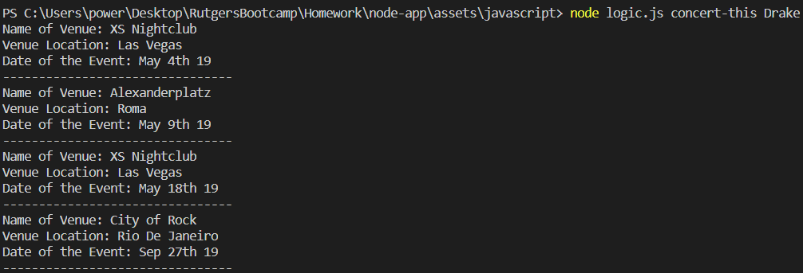
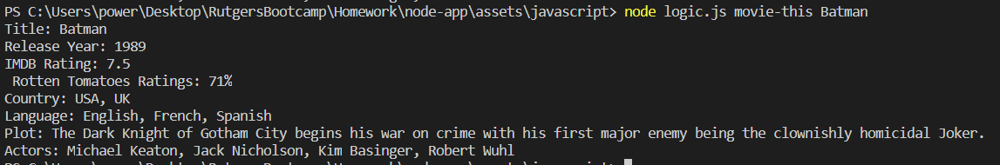
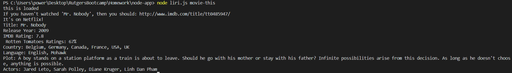
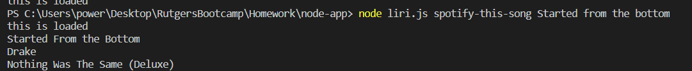
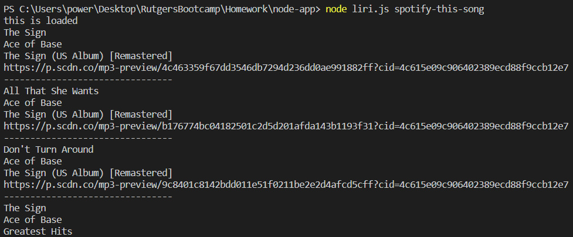

# node-app

## Overview
LIRI is a Language Interpretation and Recognition Interface. LIRI will be a command line node app that takes in parameters and gives you back data.

## Features
- LIRI will search Spotify for songs, Bands in Town for concerts, and OMDB for movies.
- If no song is provided then your program will default to "The Sign" by Ace of Base.
- If the user doesn't type a movie in, the program will output data for the movie 'Mr. Nobody'

## Tools/Languages Used
- Node.js
- Axios
- API

## 

 ### When an artist is searched it shows the venue and date.

## 

## 

