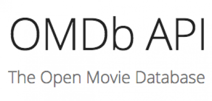

# node-app

## Overview
LIRI is a Language Interpretation and Recognition Interface. LIRI will be a command line node app that takes in parameters and gives you back data.

## Features
- LIRI will search Spotify for songs, Bands in Town for concerts, and OMDB for movies.
- If no song is provided then your program will default to "The Sign" by Ace of Base.
- If the user doesn't type a movie in, the program will output data for the movie 'Mr. Nobody'

## Tools/Languages Used
- Node.js
- Axios
- API

## 

 ### When an artist is searched it shows the venue and date: 

## 
### When a movie is searched it displays the Title, Year, IMDB rating, Rotten Tomatoes Score, Country, Language , Plot and Actors: 

### If no movie is searched then it shows the information of 'Mr. Nobody' :

## 
### When a song is searched it retrieves the information ( Name, artist and Album) from spotify and displays them in the console :

### If no songs is provided it shows the result of the song "The Sign " by Ace of Base

